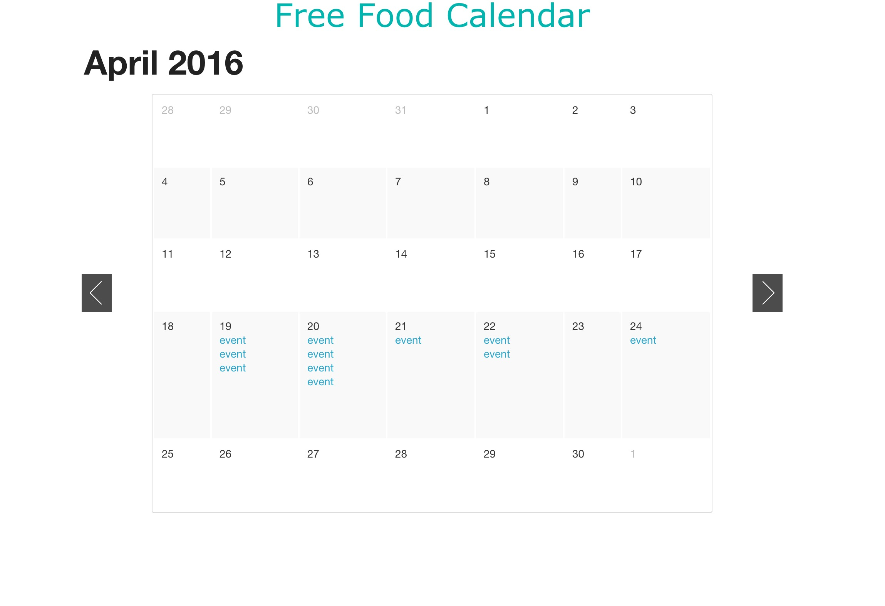

Free Food Calendar
==============

A calendar that displays events providing free food in University of Michigan   
Author: Haoran Wang, Yuliang Zou, Sang Hyuk Cho, Connor Larson   
Screen shot of the web calendar:

## Flask calendar template
The calendar template we use is from https://github.com/dAnjou/flask-calendar, which is using Flask, Jinja and Foundation's Orbit, and under MIT license (See LICENSE).

## Requirements

* environment: 
	* OSX or Linux
* install:
	* flask
	* BeautifulSoup
	* mongodb
	* scrapy
	* numpy
	* scipy
	* sklearn
* dependencies:
    * porterstemmer.py
    * stopwords

## How to use

1. Set up (in any directory):
	* `mongod` start mongoDB server (with default port: 27017)
	* `mongod` enter mongo shell
		* `use test` create/switch to database named "test"
		* `db.myCollections.ensureIndex({url:1},{unique:true})` aovid having duplicate URLs in DB
2. Run (in project base folder):
	* `python server.py` get website running
	* `update_db.py 20` run crawler, scraper and classifier to feed the database. 20 means update DB every 20 seconds
    * These two commands needs to be running on two shells.

3. Use (In browser):
	* `http://127.0.0.1:5000` website running on local host (port 5000)

4. Algorithm testing 
    * Go to test_algorithm/
    * run `python train.py`
        * Use all the data to pre-train the classifiers used in the pipeline, stored in .pkl files.
    * run `python test.py`
        * Test and compare the performance of different methods, using leave-one-out strategy and 80/20 train/test split
    ＊ Result
        * After running `python test.py` you will get four numbers, which are accuracy, precision, recall and F-measure values.
        * Details are in our final report

## File structure (major files)
* Base Project Folder /
    * crawler.py 
    * server.py
    * update_db.py
    * static /
        * foundataion /
    * templates /
        * base.html
        * cal.html
    * eventdescriptions.csv
    * involvedescriptions.csv
    * scrapy.cfg
    * url_starts.txt
    * URLs.txt
    * foodscrape /
        *  __init__.py
        *  items.py
        *  settings.py
        *  pipelines.py
        *  spiders / 
            * __init__.py
            * foodscrape_spider.py
            * classify.py
            * Porter_stemming.py
            * stopwords.txt
            * *.pkl
    * test_algorithm /
        * train.py
        * test.py
        * Porter_stemming.py
        * stopwords.txt
        * traindata /
    * raw_data /
        * eventdescriptions.csv
        * involvedescriptions.csv

## Details

###### System Prerequisites:

* Crawling: 
Crawling requires an external python library Scrapy and BeautifulSoup    
To install Scrapy use: pip install scrapy    
Further instructions can be found here:    
http://doc.scrapy.org/en/latest/intro/install.html    

* BeautifulSoup is preinstalled on CAEN:     
To use the library directory, run: module load python   
To install: pip install -U beautifulsoup4   
Further instructions can be found here:   
https://www.crummy.com/software/BeautifulSoup/bs4/doc/#   

* Classifier Test:
Some classifiers requires Scikit-Learn python library:    
Sklearn is preinstalled on CAEN.    
To use the library directory, run: module load python     
To install sklearn: pip install -U scikit-learn     
Further instructions can be found here:     
http://scikit-learn.org/stable/install.html   
(BTW, before you install sklearn, you need numpy and scipy installed, which can be installed by pip) 

* Website:
We used the Flask as web framework and MongoDB as our back-end database    
Further information can be found here:   
http://flask.pocoo.org/   
https://www.mongodb.org/   
https://github.com/dAnjou/flask-calendar

###### Crawling and Scraping Code:

* server.py
-Get the webserver running on `http://127.0.0.1:5000`

* update_db.py
-Run crawler.py, foodscrape_spider.py, classify.py to run periodically (time interval specified by commandline aruguments)

* crawler.py
-This code crawls http://events.umich.edu/list?filter=tags%3AFood and gets all the urls that contain the tag for food. 
It uses BeautifulSoup's bs4 to grab the URLs and is the same algorithm implemented in our assignment 4.

* eventdescriptions.csv
-This is the data extracted from events.umich.edu. This data is well structured and organized
and able to be directly implemented into our database to be put on our website. It contains URL, title, date, and description
of every event

* involvedescriptions.csv
-This is the data extracted from campusinvolvement.umich.edu. This data is not as well structured, the only thing that we were able to directly extract from the HTML code was URL and description for every event. Additionally, nearly all of the events on the website have already happened, making it not useful for our final implementation. This data was used for training data, however.

* scrapy.cfg
-Necessary file for ScraPy to run. No changes were made from standard ScraPy base project.

* url_starts.txt
-Seed URLs for crawler.py

* URLs.txt
-These are the URLs extracted using crawler.py and are then spidered in foodscrape_spider.py

* items.py
-These are the itmes meant to be extracted using the spiders implemented in foodscrape_spider.py

* pipelines.py
-This is the output pipeline run by ScraPy that outputs our data to MongoDB into our database.

* __init__.py
-Another necessary file for ScraPy to run. No changes were made from standard ScraPy base project.

* foodscrape_spider.py
-This is the spider that is implemented to extract events from both campusinvolvement.umich.edu and events.umich.edu. It contains two spiders to extract the items needed from the HTML source. events.umich.edu has a title, date, description, and URL that we extract from the HTML code. campusinvolvement.umich.edu has just a description, title, and URL that we take from the HTML code. This is ran with ScraPy third-party HTML scraping framework, which makes it easier to extract from multiple sites at once.

* classify.py
-This is our implementation of our trained classifiers that are held in the .pkl files.

* *.pkl
-These are our classifiers and the values/datasets they use to classify
